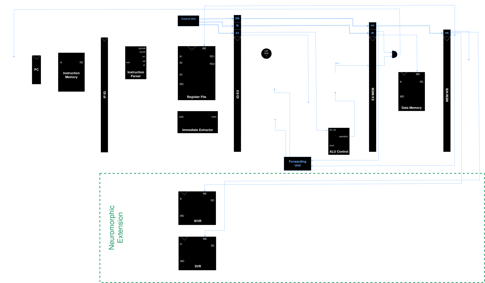

# RISC-V

Verilog source for a subset of the RV32I ISA. We use Verilator for simulation and GTKWave for waveform visualization.

## Table of Contents
- [Microarchitecture](#microarchitecture)
- [Dependencies](#dependencies)
- [Installation](#installation)
- [Usage](#usage)
  - [Compiling with Verilator](#compiling-with-verilator)
  - [Running Simulations](#running-simulations)
  - [Viewing Waveforms with GTKWave](#viewing-waveforms-with-gtkwave)
- [RVNE ISA](#rvne-isa)
  - [Synaptic weight loading instructions](#synaptic-weight-loading-instructions)
  - [Spike vector loading instructions](#spike-vector-loading-instructions)

## Microarchitecture



## Dependencies

Make sure the following tools are installed before using this project:

- **Verilator**: A tool to convert Verilog into C++/SystemC code for fast simulations.
- **GTKWave**: A waveform viewer for viewing simulation results.
- **Make**: To simplify the compilation and simulation processes.

### Installing Dependencies

1. **Verilator Installation**:
   - On Ubuntu:
     ```bash
     $ sudo apt-get install verilator
     ```
   - On macOS (using Homebrew):
     ```bash
     $ brew install verilator
     ```

2. **GTKWave Installation**:
   - On Ubuntu:
     ```bash
     $ sudo apt-get install gtkwave
     ```
   - On macOS (using Homebrew):
     ```bash
     $ brew install gtkwave
     ```

## Installation

Clone the repository using the following command:

```bash
$ git clone https://github.com/ramanjs/riscv-rvne.git
$ cd riscv-rvne
```

## Usage

### Compiling with Verilator

To compile the Verilog files using Verilator, run:

```
$ cd src
$ verilator --binary -Wall -Wno-fatal --trace testbench.v     
```

This will convert the Verilog files into C++ and compile them for simulation.

### Running Simulations

To run the simulation, use:

```
$ cd obj_dir
$ cp ../memfile.dat ./ # contains the machine code to run on the cpu
$ ./Vtestbench
```

This will run the compiled simulation and output a .vcd (Value Change Dump) file, which can be viewed using GTKWave.

### Viewing Waveforms with GTKWave

Once the simulation is complete, you can view the waveform using GTKWave:

```
$ gtkwave dump.vcd
```

This will open GTKWave, allowing you to inspect the internal signals of the RISC-V CPU during the simulation.

## RVNE ISA

### Synaptic weight loading instructions

__lw.wv/lh.wv/la.wv__

lw.wv:

| imm[11:0] | rs1[4:0] | funct3[2:0] | rd[4:0] | opcode[6:0] |
| --- | --- | --- | --- | --- |
| offset | base | 000 | WVR_dst | 0000010 |

lh.wv:

| imm[11:0] | rs1[4:0] | funct3[2:0] | hint[0] | rd[3:0] | opcode[6:0] |
| --- | --- | --- | --- | --- | --- |
| offset | base | 001 | hint | WVR_dst | 0000010 |

la.wv:

| imm[11:0] | rs1[4:0] | funct3[2:0] | hint[0] | rd[3:0] | opcode[6:0] |
| --- | --- | --- | --- | --- | --- |
| offset | base | 010 | hint | WVR_dst | 0000010 |

### Spike vector loading instructions

__lw.sv/lh.sv/la.sv__

lw.sv:

| imm[11:0] | rs1[4:0] | funct3[2:0] | rd[4:0] | opcode[6:0] |
| --- | --- | --- | --- | --- |
| offset | base | 011 | SVR_dst | 0000010 |

lh.sv:

| imm[11:0] | rs1[4:0] | funct3[2:0] | hint[0] | rd[3:0] | opcode[6:0] |
| --- | --- | --- | --- | --- | --- |
| offset | base | 100 | hint | SVR_dst | 0000010 |

la.sv:

| imm[11:0] | rs1[4:0] | funct3[2:0] | hint[0] | rd[3:0] | opcode[6:0] |
| --- | --- | --- | --- | --- | --- |
| offset | base | 101 | hint | SVR_dst | 0000010 |

### Neuron states and parameters loading instructions

lw.vt:

| funct7[6:0] | rs2[4:0] | rs1[4:0] | funct3[2:0] | rd[4:0] | opcode[6:0] |
| --- | --- | --- | --- | --- | --- |
| 000 0001 | offset | base | 111 | 00000 | 0000010 |

### Neuron current computing instructions

| funct7[6:0] | rs2[4:0] | rs1[4:0] | funct3[2:0] | rd[4:0] | opcode[6:0] |
| --- | --- | --- | --- | --- | --- |
| 111 0000 | SVR_src | WVR_src | convh | NSR_dst | 0110010 |
| 111 0001 | SVR_src | WVR_src | conva | NSR_dst | 0110010 |
| 111 0010 | SVR_src | WVR_src | convmh | NSR_dst | 0110010 |
| 111 0011 | SVR_src | WVR_src | convma | NSR_dst | 0110010 |
| 111 0100 | SVR_src | WVR_src | doth | NSR_dst | 0110010 |
| 111 0101 | SVR_src | WVR_src | dota | NSR_dst | 0110010 |
